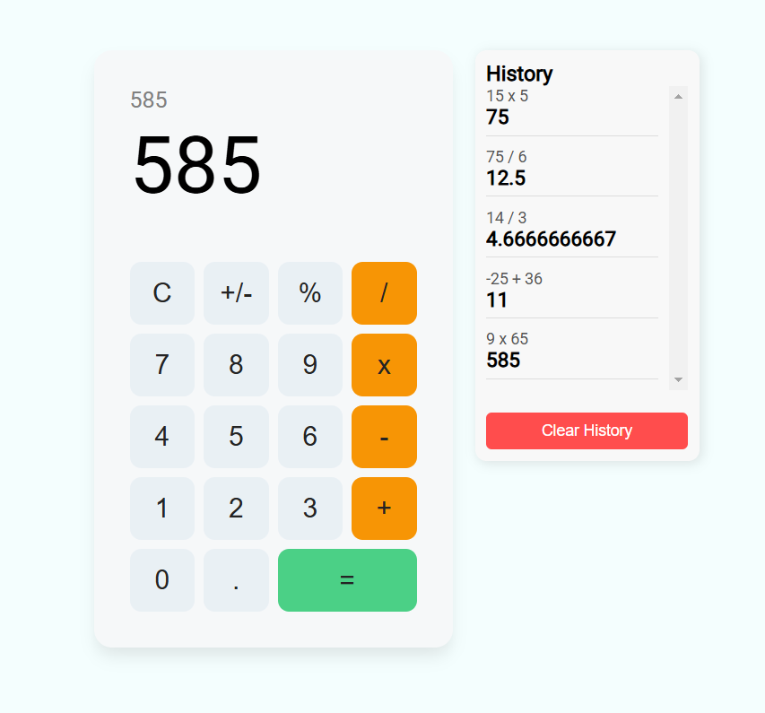

#### Problem statement:
 - Create a simple calculator app.

#### Technology Used:
 - React Js
 - Java Script
 - HTML
 - CSS

 ## Install

To install all the dependences of the project, run the following command:

    git clone https://github.com/RichardRyan141/React-Calculator
    yarn install
    yarn start

#### Source Code:
 - Link : https://github.com/RichardRyan141/React-Calculator

#### Deployment Link:
 - Link : https://react-calculator-omega-navy.vercel.app/

### Fixes
1) Fixed the positive/negative button click
2) Added an equation visualizer above the main number screen
3) Added history of operations

## Preview

